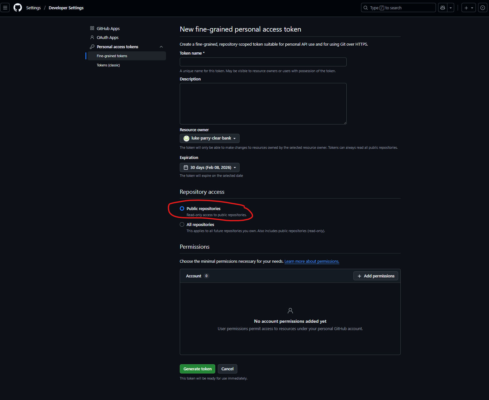
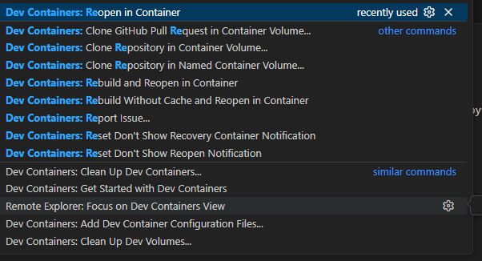
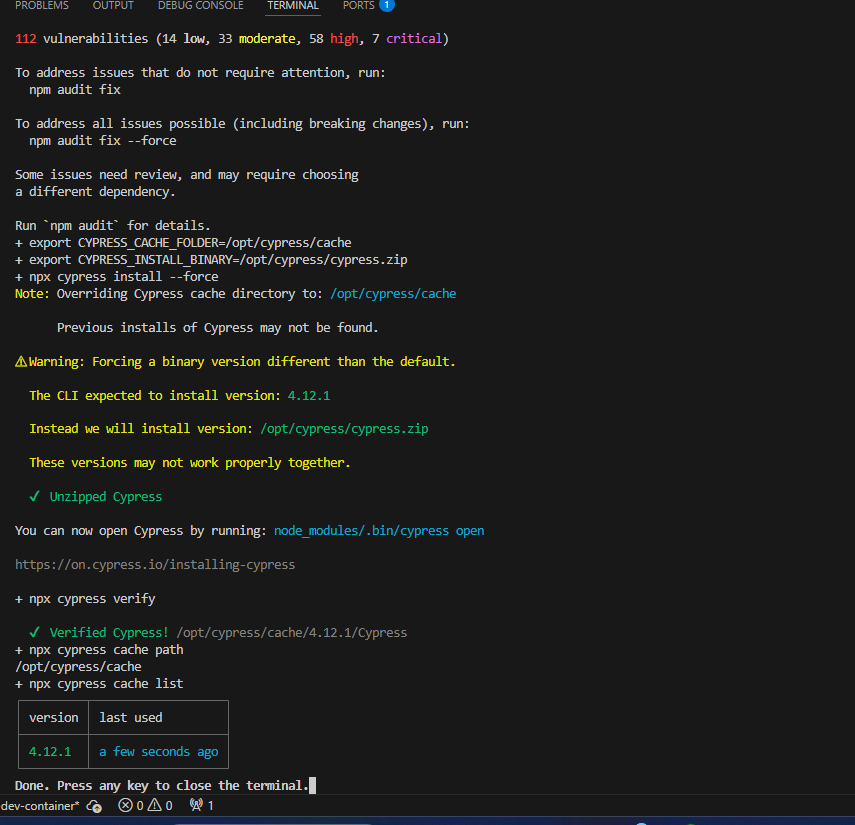
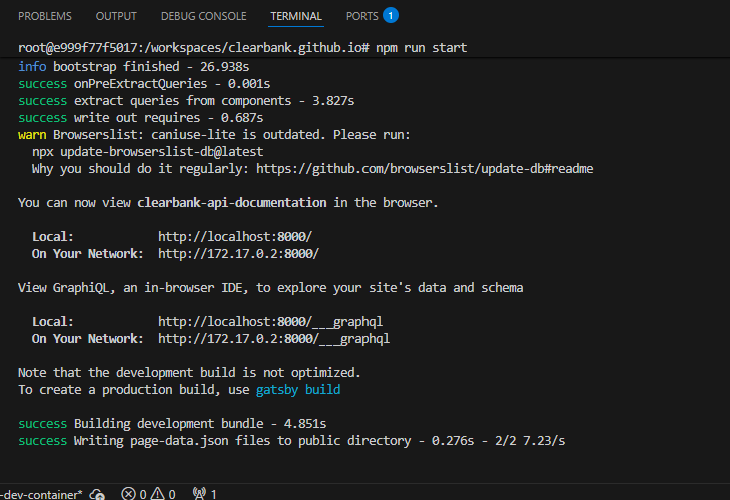

# To update the site

## Create a GitHub personal access token (PAT)

Under developer settings create a new PAT with read-only access to public repositories. Ensure you copy this once created as you can't view it again.



## Create .Env file

Create a `.Env` file in the directory root and add your GitHub token

```
GITHUB_TOKEN=<token>
```

## Running locally

### Option 1 - Run in vs code dev container (Recommended)

1) Open repository in vscode.
2) Open the Command Palette (Ctrl+Shift+P) and type `Dev Containers: Reopen in Container`



3) The dev container will be created and npm install will run. Once finished you should see output like below.



4) Open a new terminal and run `npm run start`. You should see output like below and be able to access the site on `https://localhost:8000`



### Option 2

```bash
npm install
npm run start
```

If you see errors about missing Python then install Python and run

```bash
npm config set python <path to python.exe>
```

If you see errors about missing Visual Studio then install Visual Studio 2019 build tools with the C++ workload and run

```bash
npm config set msvs_version 2019
```

## To create a new Parent and child menu
- Copy the template folder structure into the content folder
- Change the name of the menu-name.mdx and the folder to the name you want on the menu https://d.pr/i/ehGVDE
- Update the page title on the sub page https://d.pr/i/PTvK77
- You can then add markdown into the child pages https://d.pr/i/0BwQ4C

## Adding React Components

### Callout component


### WebHook tables

#### Site
To generate markdown tables for the webhook placeholders we use this site:
https://www.tablesgenerator.com/markdown_tables/

#### Files
Save the files generated files in `/data/webhook-markdown-tables`
This is so we can keep the edited copies in version control and will become the single source of truth.
Unfortunately, they're a `.tgn` format. Which is only supported with that site. CVS's didn't seem to support the formatting.

#### Steps (to load an example)
1. Go to (table generator)[https://www.tablesgenerator.com/markdown_tables/]
2. Load an example (https://d.pr/i/KTALbQ)


#### Steps to create a new table
1. Go to (table generator)[https://www.tablesgenerator.com/markdown_tables/]
2. Add in all the values, including headings (https://d.pr/i/qqigrK)
3. Hit generate, copy the code over to the mark down file
4. Replace all the `<br />` with `<br />`
5. Save the table (`.tgn` file) and add to the `/data/webhook-markdown-tables`


## Versioning

API versions appear next to the title on each page. When a user is on a page for an API with multiple versions they're able to select them from a select drop down which will take them to previous or newer ones.

Different versions get added to that drop down automatically. However, file names need to meet the below criteria:

- file names need to be the same and suffixed with the the version number
- Version numbers need to follow the pattern of `0.0.0`
- Files need to be .mdx

#### E.g

- `payments-api.mdx`
- `payments-api.0.2.10.mdx`
- `payments-api.0.1.10.mdx`

# Combined API File

`/data/apis.json`

This file gets generated at build time in the `onPreBootstrap` gatsby lifecycle hook (`/gatsby-node.js`).

This file is a combination of all the refererenced api's. This means that all the \$ref's have been converted into a normal objects.

https://github.com/APIDevTools/swagger-parser/blob/master/docs/swagger-parser.md#dereferenceapi-options-callback

### Requirements

Its important that those json files ('v1.json', 'v2.json', 'v3.json') are all **OpenAPI v3** format. Its the only way that the parser can parse them.

## Test

Tests can be run via npm scripts (`nprm run XXX`) andthe following commands:

| Command                 | Effect        |
|------------------------ | ------------- |
| `test`                  | execute all tests |
| `test:coverage`         | execute all tests and generate coverage report |
| `test:watch`            | execute all tests and watch for further test updates |
| `test:update-snapshots` | execute all tests and update all snapshots |


### Tools

* Jest
* React test utils
* jest-styled-components

### Test structure (to be extended)

#### Imports
Contains all the boilerplate imports and imports for the component file and its type declaration.

```javascript
import React from 'react'
import { render } from '@testing-library/react'
import '@testing-library/jest-dom'

import Component from './callout'

import * as Types from './callout.types'

```

#### Mounting
Each component is fully mounted with its props and unmounted after each test. React-testing-library doesn't support shallow mounting by design.

```javascript
let component: any = null
const defaultProps:Types.CalloutProps = {
  colour: 'blue'
}

beforeEach(() => {
  component = render(<Component {...defaultProps} />)
})
```

#### Rerendering
In order to see the effects of props changes components can be rerendered by calling `rerender` on the rendered component and passing the updated props.

```javascript
component.rerender(<Component {...newProps} />)
```

#### Tests

##### Snapshots

```javascript
describe('Component', () => {
  test('matches snapshot', () => {
    expect(component.asFragment()).toMatchSnapshot()
  })
})
```

#### Setting hasWindow
Since accessing the window-object when the page is compiled, results in an error, a `hasWindow()`-helper method is used to exclude certain logic from being rendered on the server. This helper-method needs to return `true` in unit-test to test client side logic.
This can be done via `jest.mock`

```javascript
jest.mock('src/utils/browser.services', () => ({
  hasWindow: () => {
    return true
  }
}))
```

#### Setting location-object
In order oder to manipulate the location-object in unit-tests it is required to manually delete the location object and and add a new object wit the required location-data. This can be done once per unit-test or for each single test separately.

```javascript
beforeAll(() => {
  // mock global location object
  delete window.location

  // set new location
  window.location = { pathname: '/doc/test' }
})
```

More information: https://remarkablemark.org/blog/2018/11/17/mock-window-location/
